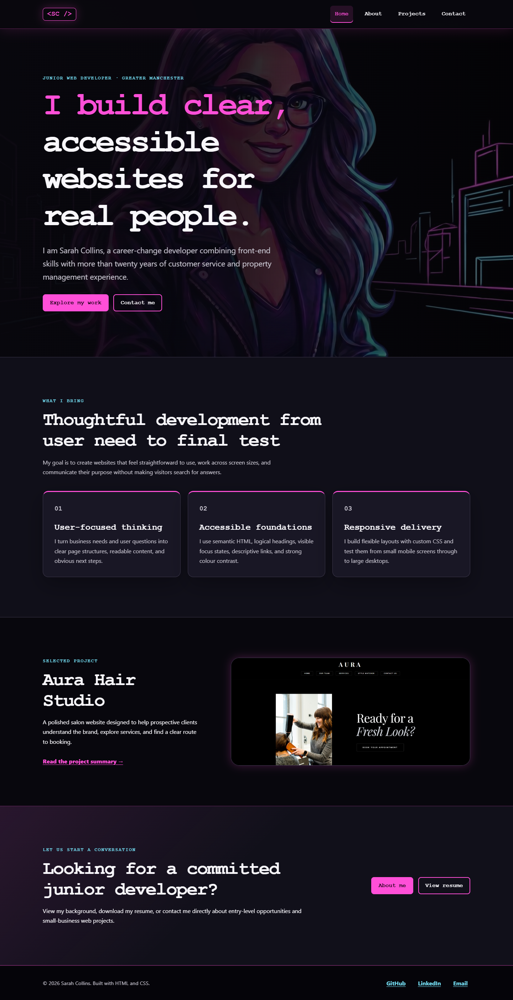
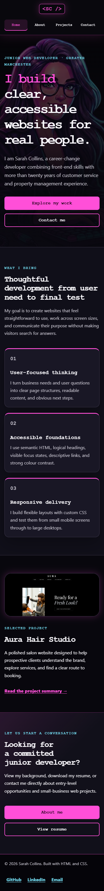
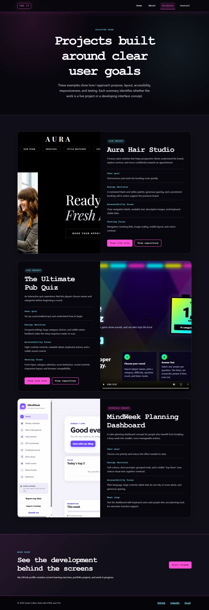

# Sarah Collins Web Developer Portfolio

[View the live website](https://www.sarahcollinsweb.dev)

[View the GitHub repository](https://github.com/alssl27/project1-portfolio)

Sarah Collins Web Developer Portfolio is a responsive, multi-page website built
with HTML and CSS for Code Institute Portfolio Project 1: HTML/CSS Essentials.
It introduces Sarah, explains her experience and skills, presents selected
project work, and gives recruiters and potential clients a direct contact route.



## Project Overview

The website supports a real-world professional goal: helping a visitor decide
whether Sarah may be a suitable junior developer, collaborator, or freelance
website provider.

The site is designed to let visitors:

- Understand who Sarah is and what she offers from the homepage.
- Learn how her previous commercial experience supports her development work.
- Review selected projects and the decisions behind them.
- View her resume and development profiles.
- Contact her by email without relying on a non-functional demonstration form.

## Target Audience

- Recruiters and hiring managers seeking a junior or trainee web developer.
- Small-business owners who need a clear, responsive brochure website.
- Developers and collaborators reviewing Sarah's work and learning progress.
- Code Institute assessors reviewing UX, accessibility, HTML, CSS, testing, and
  documentation.

## User Goals

- Find Sarah's role, location, and value quickly.
- Review relevant skills and experience.
- Understand the purpose and quality of each featured project.
- Open live projects and repositories safely.
- Contact Sarah or view her resume with minimal effort.

## Site Owner Goals

- Present a credible and professional personal brand.
- Demonstrate semantic HTML and custom CSS skills.
- Show awareness of user experience, accessibility, and responsive design.
- Provide evidence of testing and iterative improvement.
- Create opportunities for junior employment, collaboration, and freelance work.

## User Stories

| User story | Website response |
| --- | --- |
| As a recruiter, I want to understand Sarah's role and strengths quickly so that I can decide whether to review more. | The homepage opens with a clear role, location, value statement, and links to projects and contact details. |
| As a potential client, I want to see examples of Sarah's work so that I can judge whether her style suits my needs. | The Projects page presents live work and an interface concept with images, goals, design decisions, accessibility notes, and testing priorities. |
| As a keyboard user, I want to move around the site without a mouse so that I can access all content. | Every page has a skip link, logical source order, visible focus states, and standard links and native media controls. |
| As a mobile visitor, I want readable content and usable navigation so that I can browse on a small screen. | Flexible layouts and media queries reorganise navigation, cards, buttons, images, and footer content at smaller widths. |
| As a visitor who wants to make contact, I want a reliable contact route so that I do not submit information to a form that goes nowhere. | The Contact page provides a direct email link, LinkedIn, GitHub, location, and resume link. |
| As an assessor, I want project-specific planning and testing evidence so that I can evaluate the development process. | This README and [TESTING.md](TESTING.md) document users, design decisions, accessibility, bugs, checks, and remaining manual evidence. |

## UX Design Rationale

The information architecture follows the questions a new visitor is most likely
to ask:

1. **Home:** Who is Sarah, what does she build, and where should I go next?
2. **About:** What skills, qualifications, and transferable experience does she
   bring?
3. **Projects:** What has she made and how does she think about users?
4. **Contact:** How can I reach her?

The same header and footer appear on every page. The active navigation link is
identified visually and with `aria-current="page"`. Primary actions use the
pink accent, while secondary actions use an outlined treatment. Project details
are visible in the page rather than hidden behind JavaScript interactions.

### Colour Scheme

| Colour | Hex | Use |
| --- | --- | --- |
| Near black | `#08070d` | Main background |
| Dark surface | `#11101a` | Section and panel backgrounds |
| Off-white | `#f8f7fb` | Main text |
| Muted grey | `#c8c5d0` | Supporting text |
| Neon pink | `#ff4fd8` | Primary actions and brand accent |
| Cyan | `#73ddf2` | Secondary accent and labels |
| Yellow | `#fff275` | Keyboard focus indicator |

Pink and cyan are used as accents rather than as the only way to communicate
meaning. Text labels, borders, underlines, and `aria-current` support the colour
signals. The detailed palette is also recorded in
[docs/color-palette.md](docs/color-palette.md).

### Typography

The website uses system fonts so that it loads quickly and does not depend on an
external font service:

- A system sans-serif stack for readable body copy.
- `Courier New` and the browser monospace fallback for headings, navigation, and
  calls to action.
- Responsive `clamp()` values so headings scale without becoming unreadable or
  overflowing small screens.

### Imagery Choices

- The neon developer illustration supports the personal brand on the homepage.
- The profile illustration creates continuity on the About page.
- Project media is used only where it directly relates to the project summary.
- Meaningful images have descriptive alternative text.
- Decorative background imagery is applied through CSS and does not duplicate
  content for screen-reader users.

## Wireframes

No original pre-development wireframe exports were retained. To avoid presenting
new files as false historical evidence, the current information structure is
documented in [docs/wireframes.md](docs/wireframes.md) as a post-audit layout
reference. Future projects should save dated mobile and desktop wireframes
before development begins.

## Features

### Responsive Navigation

The navigation remains visible on every screen size and wraps into a compact
four-column row on smaller devices. It does not require JavaScript.

### Purpose-Led Homepage

The homepage identifies Sarah's role, location, strengths, and primary visitor
actions in the opening section.



### About and Skills

The About page combines Sarah's technical learning with the commercial and
people skills gained through her previous career.

### Project Case Studies

Each project states its status, user goal, design decision, accessibility focus,
and testing focus. Live projects include links to both the deployed site and
repository.



### Direct Contact Route

The Contact page uses a real email link and professional profile links. A
demonstration form was deliberately removed because the static project had no
backend or approved form service to deliver messages.

### Resume Access

The resume can be opened from the homepage, About page, and Contact page.

## Future Features

- Add a properly configured contact form using a secure form service when
  backend or service integration is within the project scope.
- Add more completed case studies with live links and repository links.
- Add written project retrospectives after user testing.
- Replace the interface concept with a fully deployed, tested application.
- Add an optional downloadable portfolio case-study PDF.

## Accessibility Considerations

- Semantic landmarks including `header`, `nav`, `main`, `section`, `article`,
  `aside`, and `footer`.
- One clear `h1` on every page with logical heading order.
- Skip links on every page.
- Visible high-contrast focus indicators.
- Descriptive link text rather than repeated vague labels.
- Descriptive alternative text for meaningful images.
- Native video controls and muted project media.
- No content or navigation depends on JavaScript.
- Text and interface controls reflow at 320px without horizontal scrolling.
- Reduced-motion media query removes smooth scrolling and near-eliminates
  transition duration for users who request reduced motion.

## Technologies Used

- HTML5
- CSS3
- CSS Grid
- Flexbox
- Git
- GitHub
- GitHub Pages
- PowerShell and Node.js for local project checks
- Playwright CLI for responsive browser checks and screenshots

No frameworks or custom JavaScript are used in the submitted website.

## Project Structure

```text
.
├── index.html
├── aboutme.html
├── projects.html
├── contact.html
├── README.md
├── TESTING.md
├── DISTINCTION-CHECKLIST.md
├── CNAME
├── assets
│   ├── css
│   │   └── style.css
│   ├── images
│   │   └── readme
│   ├── videos
│   │   └── project1.mp4
│   └── resume.pdf
├── docs
│   ├── color-palette.md
│   └── wireframes.md
├── tools
│   └── check-static-site.js
└── validation-reports
    └── 2026-06-12
```

## Testing

Detailed manual, responsive, browser, link, and accessibility checks are in
[TESTING.md](TESTING.md).

Run the local static-site check from the repository root:

```bash
node tools/check-static-site.js
```

### Browser Testing

The final local version should be checked in current Chromium and Microsoft Edge.
Firefox and Safari require a manual check where those browsers are available.

### Responsiveness Testing

The target test widths are:

- 320px
- 375px
- 768px
- 1024px
- 1440px

### Validator Testing

On 12 June 2026, the final local source was submitted to the official services:

- W3C Nu HTML Checker: 0 errors and 0 warnings on all four pages.
- W3C Jigsaw CSS Validator: valid CSS with 0 errors.

The current result summary is stored in
`validation-reports/2026-06-12/VALIDATION-SUMMARY.md`. Screenshots of the result
pages still need to be added before submission. Old reports were removed because
they tested a previous Bootstrap/JavaScript version.

### Lighthouse Testing

The local mobile-mode Lighthouse run on 12 June 2026 returned:

- Performance: 81
- Accessibility: 100
- Best Practices: 100
- SEO: 100

The raw report is stored at
`validation-reports/2026-06-12/lighthouse-local.json`. Performance should be
retested on the deployed host because caching and server delivery affect the
score.

## Bugs Found and Fixed

| Bug or risk | Improvement |
| --- | --- |
| The submitted site depended on Bootstrap despite the HTML/CSS-only brief. | Replaced framework classes and components with custom HTML and CSS. |
| JavaScript controlled navigation, typewriter text, motion, modals, and form feedback. | Removed custom JavaScript and made all core content and navigation available as static HTML. |
| The Projects page contained malformed nested article markup and mismatched project titles. | Rebuilt the project structure with valid articles and project-specific content. |
| Some image paths used Windows backslashes. | Standardised all web paths with forward slashes. |
| One image filename contained a space and a spelling error. | Renamed it to `mindweek-dashboard.png`. |
| Project summaries described screenshots that did not match the visible work. | Rewrote each summary to match the real media and labelled concept work honestly. |
| The contact form validated information but did not send it anywhere. | Replaced it with a reliable direct email route and professional profile links. |
| Social links used icon fonts and labels that were not visible to every visitor. | Replaced icons with visible text links. |
| Background video increased motion, weight, and complexity. | Replaced it with a responsive static background image. |
| Old screenshots and validator files represented a previous implementation. | Removed stale evidence so final documentation cannot accidentally mislead the assessor. |
| The repository contained a separate React/Tailwind prototype. | Removed the prototype from the PP1 submission boundary. |

## Known Bugs

No known functional bugs remain in the local HTML/CSS build at the time of the
final local test. The following evidence still requires manual completion after
the final deployment:

- Screenshots of the passing W3C HTML and CSS validator pages.
- Lighthouse results and screenshot for the final live site.
- Firefox and Safari testing where available.
- A final comparison between the local site and the deployed site.

## Deployment

The project uses GitHub Actions to deploy the static files to GitHub Pages.

1. Push the final branch to GitHub.
2. Open the repository **Settings**.
3. Select **Pages**.
4. Set the source to **GitHub Actions**.
5. Open the **Actions** tab and confirm that `Deploy static site to Pages`
   completes successfully.
6. Visit [www.sarahcollinsweb.dev](https://www.sarahcollinsweb.dev).
7. Retest navigation, project links, email links, media, resume access, and
   responsive layouts on the deployed site.

To preview locally:

```bash
python -m http.server 8000
```

Then open `http://localhost:8000`.

## Version Control

Git is used for local version control and GitHub stores the remote repository.
Git history should not be rewritten for assessment. Final changes should be
committed in small, descriptive groups where practical.

Suggested future commit messages:

- `Add semantic HTML structure`
- `Improve responsive navigation`
- `Add accessibility alt text`
- `Refactor CSS sections`
- `Update README testing evidence`
- `Fix broken internal links`
- `Improve mobile layout`

## Credits and Acknowledgements

### Code

All submitted website HTML and CSS is custom project code. No framework,
component library, copied template, or custom JavaScript is used in the final
site.

### Media

- Profile and developer illustrations were supplied by the site owner.
- Project screenshots and project video were supplied by the site owner and
  represent Sarah's work or identified interface concept.
- Resume content and contact details were supplied by the site owner.

### Acknowledgements

- Code Institute course material and assessment guidance.
- W3C HTML and CSS validation services.
- GitHub Pages for static hosting.
